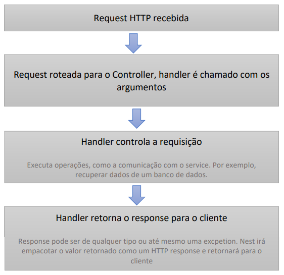

# Controllers

* Responsáveis por lidar com as requisições recebidas e retornar responses para o cliente;
* Encaminham as requisições para um path específico. Exemplo: “/jogadores” para o resource jogadores;
* São definidos quando anotamos uma classe com o decorator @Controller;
* O decorator aceita uma string, que é o path a ser controlado pelo controller:

.png>)

* Pussuem handlers, que lidam diretamente com métodos HTTP, tais como: GET, POST, DELETE, etc.:
  * Handlers são métodos implementados dentro classe controller, que são anotados com os decorators @Get, @Post, @Delete, etc.

.png>)

**nest g controller nome-controller** -> Cria um novo controller;
