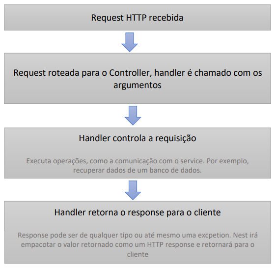

# Services

* São definidos como providers, porém, nem todos providers são services;
* Tratam-se de um conceito comum no contexto de desenvolvimento de software e não são exclusivos do NestJS, JavaScript ou qualquer tecnologia de desenvolvimento backend;
* São singletons, quando decorados com @Injectable(), e fornecidos a um module. Ou seja, uma mesma instância será compartilhada em toda a aplicação;
* É onde nossa lógica de negócios deverá ser implementada.

Fluxo de uma requisição HTTP no NestJS

<figure><figcaption></figcaption></figure>

Criar um service: **nest g service jogadores**
